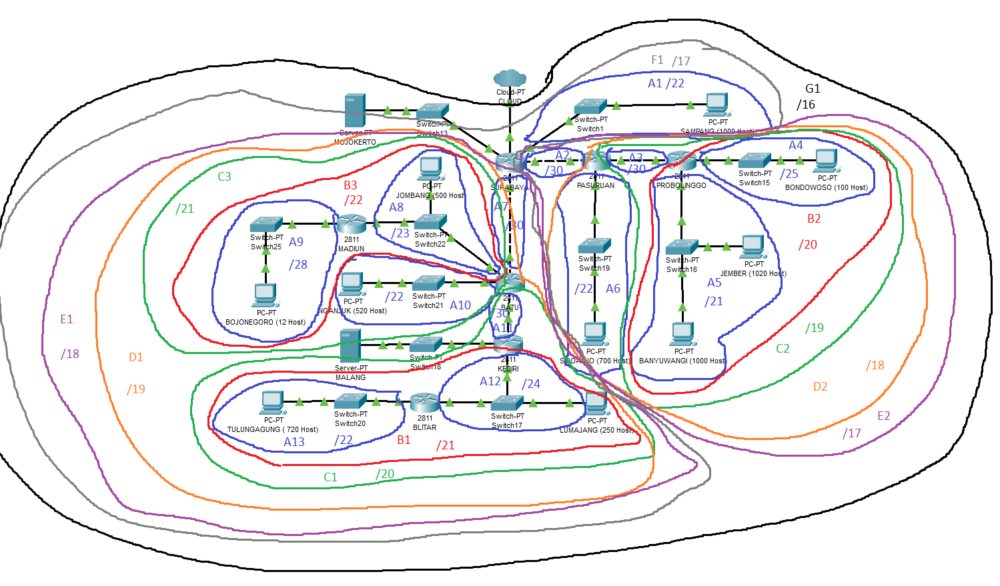

# Modul4_C09
Kelompok C09
- 05111840000028  M. Frediansyah Sinaga
- 05111840000072  Kresna Adhi Pramana

Praktikum Modul 4 berupa *Subnetting dan Routing*.

## Soal

Catatan
1. Deadline hari Rabu, 9 Desember 2020 pukul 22.00
2. Soal shift dikerjakan pada Cisco Packet Tracer dan UML menggunakan metode
    perhitungan CLASSLESS yang berbeda .
    Keterangan: Bila di CPT menggunakan VLSM , maka di UML menggunakan CIDR
    atau Sebaliknya
3. Jika tidak ada pemberitahuan revisi soal dari asisten, berarti semua soal BERSIFAT BENAR
    dan DAPAT DIKERJAKAN .
4. CLOUD diberikan IP TUNTAP.
5. Server diberikan IP DMZ.
6. Berikan memori sebesar 64MB pada setiap UML.
7. Pembagian IP dan routing harus SE-EFISIEN MUNGKIN.
8. Pastikan semua UML dapat melakukan ping ke its.ac.id

Hal yang perlu diperhatikan
1. Hasil perhitungan subnetting dan pohon pembagian IP serta file .pkt dikirim ke email
    asisten penguji (Daftar asisten penguji keluar hari Rabu, 9 Desember 2020 pukul 12.00
    WIB)
2. File yang didemokan adalah file .pkt yang telah dikirim ke asisten.
3. Maksimal menghubungi asisten untuk demo hari Kamis, 10 Desember 2020 pukul
    20.00 WIB
4. Pengurangan nilai akan dilakukan ketika:
    1. Melanggar salah satu dari tulisan diatas.
    2. Hasil perhitungan untuk VLSM / CIDR, berbeda dengan di CPT / UML
    3. Pembagian IP kurang efisien
    4. Routing kurang efisien
    5. Tidak bisa menjelaskan cara perhitungan VLSM dan CIDR
    
    
## Jawaban

### VLSM - CPT
1. Membagi jaringan pada soal menjadi 13 subnet.
    
    
2.  Menentukan jumlah alamat IP yang dibutuhkan oleh tiap subnet dan melakukan labelling netmask berdasarkan jumlah IP yang dibutuhkan.
    | Subnet  | Jumlah IP | Netmask   |
    | ------- | --------- | --------- |
    | A1      | 1001      | /22       |
    | A2      | 2         | /30       |
    | A3      | 2         | /30       |
    | A4      | 101       | /25       |
    | A5      | 2021      | /21       |
    | A6      | 701       | /22       |
    | A7      | 2         | /30       |
    | A8      | 502       | /23       |
    | A9      | 13        | /28       |
    | A10     | 521       | /22       |
    | A11     | 2         | /30       |
    | A12     | 252       | /24       |
    | A13     | 721       | /22       |
    | Total   | 5841      | /19       |
    
    Berdasarkan total IP dan netmask yang dibutuhkan, maka kita dapat menggunakan netmask /19 untuk memberikan pengalamatan IP pada subnet.
3. Subnetting dengan menggunakan pohon untuk pembagian IP sesuai dengan kebutuhan masing-masing subnet yang ada.
    
4. Dari pohon tersebut akan mendapat pembagian IP sebagai berikut.
    
5. Untuk file .pkt dapat diakses [disini](Modul4_KelompokC09_Jarkom2020_VLSM.pkt).

### CIDR - UML
1. Membagi jaringan pada soal menjadi seperti gambar berikut.
      
    
2. Pembagian IP dengan pohon berdasarkan penggabungan subnet yang telah dilakukan.
      
3. Berdasarkan perhitungan, maka didapatkan pembagian IP sebagai berikut.
      
4. Membuat `topologi.sh`
5. Membuat `bye.sh`
